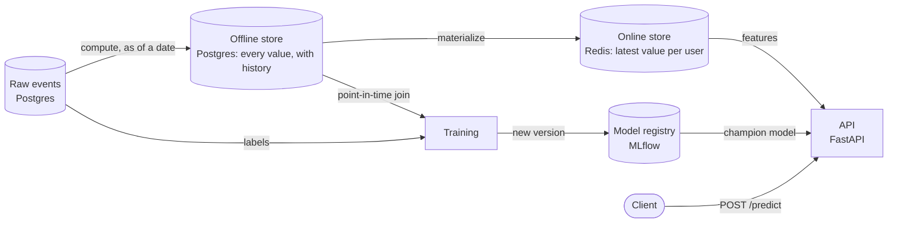

# Feature store from scratch

[](https://github.com/silasnatter/feature-store-system/actions/workflows/ci.yml)

A feature store computes the inputs of a machine-learning model once and gives the same values to training and to live predictions. This project builds one from its parts, without a feature-store framework, to show how each part works.

It runs on a laptop with Docker, on generated e-commerce data, and answers one question: will this user place an order in the next 30 days?

## What it does

- **Computes features as of any date.** A feature view is a SQL query that reads only events from before that date. Running it for every day gives each feature a history.
- **Builds training sets without leakage.** A point-in-time join gives each training row the feature values that were known at that row's moment, never later ones.
- **Serves the latest values fast.** The newest values are copied to Redis, and an API reads them from there.
- **Trains, registers and serves a model.** MLflow stores every model version; the API serves the one marked as champion and logs each prediction.
- **Runs on a schedule.** Airflow computes, checks and publishes the features daily, and checks weekly whether the model needs retraining.
- **Watches itself.** Quality, freshness, drift and model score are recorded, and a retrained model replaces the champion only if it scores higher.

## Architecture



Airflow drives the arrows on the left: `compute`, a check, and `materialize` every day, and the retraining check every week. Each Airflow step calls the same command line you can run by hand.

| Part | Technology | Holds |
|---|---|---|
| Raw events | PostgreSQL, schema `raw` | Users, products, product views, orders |
| Registry | PostgreSQL, schema `feature_store` | Feature views and feature definitions, with their thresholds |
| Offline store | PostgreSQL, table `feature_values` | Every feature value, per user and day |
| Online store | Redis | The latest values, one hash per user |
| Model registry | MLflow | Training runs, model versions, the `champion` alias |
| API | FastAPI | Feature lookup, predictions, status |
| Scheduler | Airflow | The daily and the weekly pipeline |

## The core idea: nothing from the future

A training row says: at this moment the user looked like this, and afterwards they did or did not buy. The features must be the values known at that moment. If today's values slip in, the model learns from information that came after the outcome it predicts. It then looks excellent in testing and fails in use.

Three rules keep the future out:

1. **Features look back.** A feature view computed as of a date reads only events from before that date, and its values are stored with that date as their timestamp.
2. **The join looks back.** For each training row, the point-in-time join takes the newest stored value at or before the row's moment, and nothing older than the view's time to live:

   ```sql
   LEFT JOIN LATERAL (
       SELECT fval.value
       FROM feature_store.feature_values fval
       WHERE fval.feature_id = f.feature_id
         AND fval.entity_id = input.entity_id
         AND fval.event_timestamp <= input.ts                             -- never from the future
         AND (f.ttl IS NULL OR fval.event_timestamp >= input.ts - f.ttl)  -- never stale
       ORDER BY fval.event_timestamp DESC
       LIMIT 1
   ) AS v ON true
   ```

3. **Labels look forward.** The label reads only events from the row's moment on, so no order can be both an input and the answer.

The test that pins this down stores a value on day 1 and a very different one on day 3, then asks for day 2:

```python
def test_never_returns_a_value_from_the_future(conn):
    store(conn, "spend", 1, day(1), 10.0)
    store(conn, "spend", 1, day(3), 999.0)

    rows = get_historical_features(conn, [(1, day(2))], ["spend"])

    assert rows[0]["spend"] == 10.0
```

The same promise holds at serving time: for all 2,000 users, Redis holds exactly the values the offline store has for that moment, so the model sees the same inputs in production as in training.

## Results

Measured on this project, on an Apple M2 laptop with every service in Docker.

**Data.** 2,000 users, 200 products, 127,219 product views and 11,470 orders over 270 days. The generator is seeded, so everyone gets the same data.

**Offline store.** 1,703,752 feature values: one snapshot per day for 270 days. The point-in-time join for 11,346 training rows and four features takes 0.5 seconds.

**Model.** Trained on February to June, tested on July and August:

| | ROC AUC | Precision when catching 75% of buyers |
|---|---|---|
| Rule: "ordered in the last 30 days" | 0.838 | 0.663 |
| Logistic regression (served) | 0.936 | 0.741 |
| Gradient boosting | 0.942 | 0.715 |

Gradient boosting is not clearly better, so the simpler model is the one in use. The comparison is in `ml/train.py`.

**Latency.** 2,000 requests, one after another, from one local client against a single development server:

| Endpoint | Median | 95th percentile | 99th percentile |
|---|---|---|---|
| `GET /features/online/...` | 1.9 ms | 4.0 ms | 11.0 ms |
| `POST /predict` | 5.0 ms | 11.1 ms | 19.6 ms |

**Monitoring.** One feature, `days_since_last_order`, drifts away from the training data on every day of September. Its drift score is 0.35 to 0.53, depending on which months the champion was trained on, where 0.25 counts as significant. The model's score stays at about 0.93, and a retrained model is at best 0.001 better. See [What this is not](#what-this-is-not) for why.

**Tests.** 122 tests, about 18 seconds, run in CI against real PostgreSQL and Redis.

## Quickstart

Requires Docker and [uv](https://docs.astral.sh/uv/). uv installs Python 3.12 if it is missing.

```bash
docker compose up -d     # Postgres 5432, Redis 6379, MLflow 5001, Airflow 8080
uv sync
```

The first `docker compose up` builds the Airflow image, which takes a few minutes. To change ports or passwords, copy `.env.example` to `.env` first.

Then fill the store, in this order:

```bash
# 1. Generate the raw events
uv run python -m feature_store.datagen

# 2. Write the feature definitions to the registry
uv run python -m feature_store apply

# 3. Compute one snapshot per day
uv run python -m feature_store backfill --view user_purchase_stats --start 2026-01-02 --end 2026-09-28

# 4. Copy the latest values to Redis
uv run python -m feature_store materialize --view user_purchase_stats --as-of 2026-09-28

# 5. Train the model and register it as champion
uv run python -m feature_store train --start 2026-02-01 --end 2026-08-01 --test-from 2026-07-01

# 6. Start the API
uv run uvicorn feature_store.api:app
```

Ask for a prediction:

```bash
curl -X POST localhost:8000/predict -H 'content-type: application/json' -d '{"user_id": 1727}'
```

| Open | To see |
|---|---|
| http://localhost:8000/docs | The API, with a form for each endpoint |
| http://localhost:5001 | MLflow: training runs and model versions |
| http://localhost:8080 | Airflow, no login. Unpause `daily_features` and `retrain_model` to let them run. |

Run the tests with `uv run pytest`. They need Postgres and Redis running, and use their own database, so the data above is not touched.

## How it works

### Data

`feature_store.datagen` writes seeded e-commerce events to the `raw` schema. Each user has a browsing rate, a conversion probability and a date on which they stop shopping, so recent activity carries real signal about future orders. Each run replaces the previous contents; `--help` lists the options.

### Features

A feature view is a SQL file in `feature_store/feature_sql/` with one parameter, `as_of`, plus an entry in `feature_store/definitions.py` that names its features and their thresholds. The one view here, `user_purchase_stats`, has four features: orders in the last 30 days, average order value in the last 30 days, days since the last order, and product views in the last 7 days.

```bash
uv run python -m feature_store compute --view user_purchase_stats --as-of 2026-09-28
uv run python -m feature_store backfill --view user_purchase_stats --start 2026-01-02 --end 2026-09-28
```

`compute` stores the values with `as_of` as their timestamp; `backfill` does that for midnight UTC of every day in a range. Computing the same moment again writes nothing unless the raw data changed, so both are safe to repeat.

### Online store and API

`materialize` copies each user's latest valid values into Redis, one hash per user and view (`user_purchase_stats:7`). Two things to know about it:

- **It needs a date.** Without `--as-of` it uses the current time. The generated data ends on 2026-09-28, so as of today every value is older than the view's two-day time to live and nothing is copied.
- **Redis only moves forward in time.** Materialising as of an earlier moment than the one Redis holds is skipped, so re-running an old date cannot replace newer values. `--force` overrides this.

| Endpoint | Reads from | Purpose |
|---|---|---|
| `GET /features/online/{view}/{entity_id}` | Redis | Latest values for one user |
| `POST /features/historical` | Postgres | Point-in-time correct values for training rows |
| `POST /predict` | Redis, MLflow | Probability that a user orders in the next 30 days |
| `GET /features` | Postgres | The features in the registry |
| `GET /monitor/status` | Postgres | Health of every feature and of the model |
| `GET /health` | Postgres, Redis | Checks that both stores answer |

```bash
curl localhost:8000/features/online/user_purchase_stats/9
curl -X POST localhost:8000/features/historical -H 'content-type: application/json' \
  -d '{"entity_rows": [{"entity_id": 7, "event_timestamp": "2026-06-01T12:00:00Z"}], "features": ["order_count_30d"]}'
```

### Model

```bash
uv run python -m feature_store train --start 2026-02-01 --end 2026-08-01 --test-from 2026-07-01
```

`train` builds a training set from the first of each month in the range: labels joined with point-in-time features. It trains on the months before `--test-from`, measures on the rest, and stores the run and the model in MLflow. A month whose 30-day outcome window reaches past the end of the raw data is rejected, because its labels are not final.

`/predict` reads the user's features from Redis, applies the champion and logs the prediction to `feature_store.predictions` with the feature values the model saw. The model is kept in memory. At most once a minute the API asks MLflow whether the champion has changed, so a promoted model goes live without a restart. If MLflow is down, the model in memory keeps serving.

`ml/explore.py` and `ml/train.py` are the exploration behind the model: a look at the training set, two baselines, and the two models compared. They read `data/training_set.csv`, which this command writes:

```bash
uv run python -m feature_store training-set --start 2026-02-01 --end 2026-08-01 --out data/training_set.csv
```

### Pipelines

Airflow runs two DAGs. The Airflow container holds this project in its own virtualenv, separate from Airflow's packages, and every step is a call to the command line above. The code in `feature_store/` is mounted from the repo, so code changes need no rebuild; after changing dependencies, run `docker compose build airflow`.

`daily_features`, once per day:

```
compute  ->  validate  ->  materialize
compute  ->  monitor
```

- `validate` checks the day's values against the thresholds in the feature definitions. If one is broken, the run fails and `materialize` does not copy the values to Redis.
- `monitor` records the day's quality and drift checks. It only records; an alert does not fail the run.

`retrain_model`, once per week:

```
check  ->  retrain
```

- `check` asks whether there is a reason to retrain. If there is none, both steps are skipped.
- `retrain` trains a new model and scores it and the champion on the same held-back snapshot. The new model becomes the champion only if its ROC AUC is higher. Otherwise it stays in MLflow as a version and the champion remains.

Both DAGs start on 2026-09-01 and end on 2026-09-28, where the generated data ends. Earlier dates can be run as a backfill:

```bash
docker compose exec airflow airflow backfill create --dag-id daily_features --from-date 2026-08-01 --to-date 2026-08-31
```

### Monitoring and retraining

| What | How | Alert when |
|---|---|---|
| Quality | Values exist, share of nulls, expected range, per feature and day | A threshold in the feature definition is broken |
| Freshness | Age of each feature's newest values | Older than the feature's `freshness_hours` |
| Drift | Population stability index (PSI) of each model feature against the data the champion was trained on | PSI of 0.25 or more; warning from 0.1 |
| Model | The champion's ROC AUC on the newest snapshot whose 30-day outcome is known | More than 0.03 below its score at training |

Every check is recorded in `feature_store.monitor_logs`. `GET /monitor/status` returns the latest outcome of each check and the worst one as the overall status. It answers for now by default; add `?as_of=2026-09-28T06:00:00Z` to ask about another moment.

The drift reference is stored with each model in MLflow when it is trained, so drift always means "different from what this champion learned from". A feature with a drift alert, or a champion that scores clearly worse than at training, is a reason to retrain.

```bash
uv run python -m feature_store monitor --view user_purchase_stats --as-of 2026-09-28
uv run python -m feature_store retrain-needed --as-of 2026-09-27    # exit status 99: not needed
uv run python -m feature_store retrain --as-of 2026-09-27
```

`retrain --as-of D` holds back the snapshot 30 days before D as the test set, and trains on the first of each month whose own 30-day outcome window closed before that snapshot.

## What this is not

This is a learning project. It shows how the parts of a feature store fit together; it is not built to run a business on.

- **The data is generated and stops.** It ends on 2026-09-28 and nothing arrives after that. Asked about today, the status endpoint reports every feature as stale, which is correct.
- **No security.** The API, Airflow and MLflow have no login, and the passwords are defaults.
- **One machine.** Everything runs in Docker on a laptop. The offline store is a single Postgres table, which is fine for millions of values and not for billions. Airflow runs in its single-container mode, which is meant for local use.
- **Batch features only.** Features are numbers computed once a day. There are no streaming features and none computed at request time.
- **No feature versions.** Changing a view's SQL changes what its features mean, and old values are not marked as different. Recomputing a day updates and adds values but does not remove users who no longer appear.
- **No schema migrations.** The scripts in `postgres/init/` run only when the database volume is first created.
- **The latency numbers are not a load test.** They come from one client sending one request at a time.
- **One drift alert is built in.** `days_since_last_order` grows as the history gets longer, so it always looks different from earlier training data. The weekly check therefore retrains every week without finding a better model. Capping the feature would fix it.
- **The promotion rule is simple.** A new model wins on a higher ROC AUC on one held-back snapshot, with no minimum gain. In this data that promoted a model on a gain of 0.001.
- **The DAG files have no automated tests.** They were tested by running them.

## Layout

```
feature_store/
  config.py          Settings from the environment or .env
  db.py              Postgres connection and pool
  registry.py        Feature views and feature definitions
  datagen.py         Synthetic event generator
  definitions.py     The feature views and features of this project
  feature_sql/       One SQL file per feature view
  compute.py         Compute a view as of a moment; backfill a date range
  historical.py      Point-in-time join for training sets
  label_sql/         One SQL file per label
  training.py        Training sets: labels joined with point-in-time features
  modeling.py        The purchase model: train, store in MLflow, load, predict
  online.py          Redis online store and materialisation
  validation.py      Quality checks on a snapshot; the gate before it goes online
  monitoring.py      Drift, freshness, the check log and the status summary
  retraining.py      Monitor against the champion, decide on retraining, retrain
  api.py             FastAPI app
  __main__.py        Command line
ml/                  Exploration scripts
orchestration/       Airflow image and DAGs
postgres/init/       Schema and databases, applied on first container start
tests/               pytest suite
```
